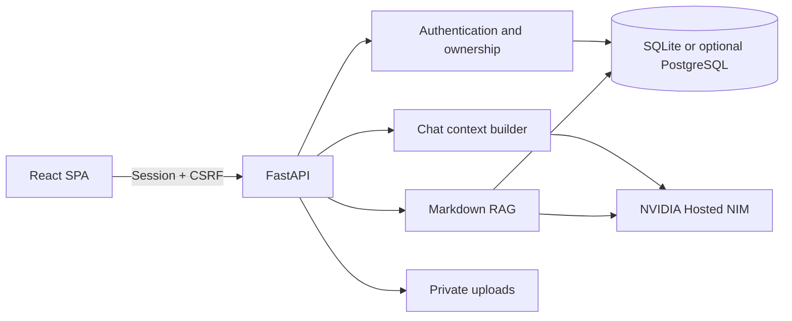

# NVIDIA NIM RAG Platform

[繁體中文](README.md) | **English**

[](https://github.com/richie7p/nvidia-nim-rag-platform/actions/workflows/ci.yml)

A self-hostable, rebrandable RAG application whose Markdown knowledge base can be replaced without rebuilding the product from scratch.

This repository is the generic platform edition. It does not ship with a preloaded school, company, or turtle knowledge base. Bring your own NVIDIA NIM API key, add your documents, and configure an organization-specific AI assistant.

It is a practical starting point for campus information services, internal company documentation, association portals, product support, and other private-knowledge assistants. For a complete domain implementation, see the [Turtle Care Assistant demo](https://github.com/richie7p/turtle-care-assistant-demo).

## Highlights

- React and TypeScript frontend with a FastAPI backend
- SQLAlchemy persistence with SQLite by default and a configurable `DATABASE_URL`; PostgreSQL requires a compatible driver and deployment-specific validation
- NVIDIA Hosted NIM chat streaming, vision, and embeddings; no local model download
- Registration, login, HttpOnly sessions, CSRF protection, Argon2 password hashing, and resource ownership checks
- Multiple conversations, SSE streaming, automatic titles, rolling summaries, Markdown rendering, and citation cards
- Markdown RAG with optional YAML frontmatter, nested directories, and removal synchronization
- Admin console for users, AI usage, knowledge-vector status, provider health, and audit events
- Environment-based branding, labels, copy, disclaimers, and model selection
- File-based or environment-provided system prompts
- A production frontend build served by FastAPI, so one service can host the application

## Intended customization boundary

You can change the following without application-code changes:

- Markdown documents and source metadata
- Branding, UI labels, welcome copy, and disclaimer text
- The system prompt and response behavior
- Supported NVIDIA NIM model identifiers

Structured domain workflows still require code. For example, a Student Profile, customer case record, approval flow, or institution-specific permission model needs corresponding database fields, API endpoints, and frontend components.

The code defines a `ModelProvider` abstraction for chat, streaming, vision, and embeddings. NVIDIA Hosted NIM is the only provider implemented in this release. A local vLLM deployment or another OpenAI-compatible service would require a new provider implementation and operational configuration; it is not a current drop-in option.

## Architecture



## Requirements

- Python 3.11
- Node.js 22 or newer
- An NVIDIA NIM API key for AI and embedding operations

Accounts, settings, and the admin interface can run without an API key, but AI requests will return a safe configuration error.

## Quick start on Windows

```powershell
python -m venv .venv
.\.venv\Scripts\python.exe -m pip install -r backend\requirements-dev.txt
Set-Location frontend
npm.cmd install
Set-Location ..
Copy-Item .env.example .env
```

Edit `.env` and provide your own secrets:

```env
SESSION_SECRET=replace_with_a_random_value_of_at_least_32_characters
AI_API_KEY=your_NVIDIA_NIM_API_key
```

Initialize the database, create an administrator interactively, and start the application:

```powershell
Set-Location backend
..\.venv\Scripts\python.exe -m alembic upgrade head
..\.venv\Scripts\python.exe -m app.cli init-db
..\.venv\Scripts\python.exe -m app.cli create-admin
Set-Location ..
.\start.cmd
```

Open <http://127.0.0.1:8000>. In development mode, API documentation is available at <http://127.0.0.1:8000/api/docs>.

## Quick start on macOS or Linux

```bash
python3 -m venv .venv
.venv/bin/python -m pip install -r backend/requirements-dev.txt
cd frontend
npm ci
npm run build
cd ..
cp .env.example .env
```

After editing `.env`:

```bash
cd backend
../.venv/bin/python -m alembic upgrade head
../.venv/bin/python -m app.cli init-db
../.venv/bin/python -m app.cli create-admin
cd ..
.venv/bin/python -m uvicorn app.main:app --app-dir backend --host 127.0.0.1 --port 8000
```

PostgreSQL is not exercised by the included CI workflow. Before using it in production, install a compatible SQLAlchemy driver and run migrations and integration tests against a staging PostgreSQL instance.

## Add your own RAG content

1. Put `.md` files in `knowledge/`; nested directories are supported.
2. YAML frontmatter is optional. Without it, the importer derives metadata from the first heading, filename, and local defaults.
3. Validate documents without calling an AI service:

```powershell
Set-Location backend
..\.venv\Scripts\python.exe -m app.cli validate-knowledge
```

4. Create or update embeddings:

```powershell
..\.venv\Scripts\python.exe -m app.cli sync-knowledge
```

Administrators can also run synchronization from the Knowledge tab. Modified files are re-chunked and re-embedded. Removed files are deactivated and excluded from retrieval.

### Optional frontmatter

```markdown
---
slug: leave-policy
title: Leave Policy
description: Employee leave requests and approval rules
source_name: Human Resources
source_url: https://example.edu/policy/leave
reviewed_at: 2026-08-12
tags: [hr, leave]
---

# Leave Policy

Place the complete source content here.
```

`source_url` may be omitted. The citation card will still show the document name without creating an external link.

## Branding and prompts

Use `.env` to configure `APP_NAME`, `APP_ICON`, `ASSISTANT_NAME`, `KNOWLEDGE_LABEL`, welcome copy, and the disclaimer. The default prompt lives at:

```text
prompts/assistant.md
```

Set `SYSTEM_PROMPT=` to override the file. Restart the service after changing environment variables or prompt content.

## Default NVIDIA models

- Chat: `nvidia/nemotron-3-nano-30b-a3b`
- Fallback: `mistralai/mistral-nemotron`
- Vision: `nvidia/nemotron-nano-12b-v2-vl`
- Embeddings: `nvidia/llama-nemotron-embed-1b-v2`

Hosted model availability can change. All identifiers are configurable in `.env`.

NVIDIA's current [vision model card](https://build.nvidia.com/nvidia/nemotron-nano-12b-v2-vl/modelcard) lists the default vision model's supported language as English only. If reliable Traditional Chinese image responses are required, run a live Chinese smoke test with a private key and select a vision model that explicitly supports the target language when necessary.

## Tests

```powershell
Set-Location backend
..\.venv\Scripts\python.exe -m pytest -q
Set-Location ..\frontend
npm.cmd test
npm.cmd run build
npm.cmd run test:e2e
```

Automated tests use an internal fake provider and do not require or expose a NVIDIA key. A real NIM smoke test must be run separately with a private, valid key.

## Security notes

- Never commit `.env`, databases, uploads, passwords, or API keys.
- Revoke any key that has appeared in a public issue, commit, screenshot, or chat.
- The admin APIs expose operational aggregates and technical usage records, not private message content.
- Before public deployment, configure HTTPS, production mode, trusted origins, and an external secret-management service.
- Review organization-specific privacy, retention, backup, and access-control requirements before using real institutional data.

## License

MIT
