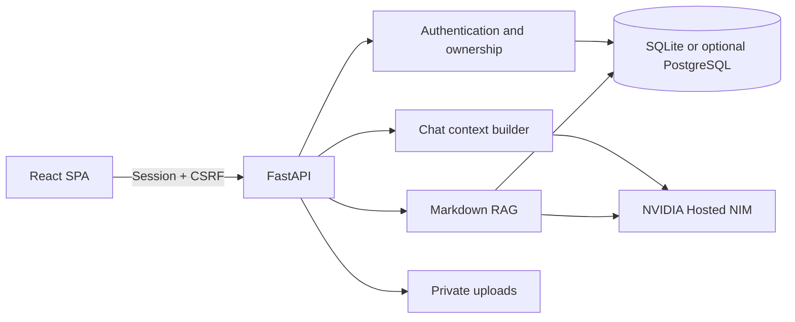

# NVIDIA NIM RAG Platform

[繁體中文](README.md) | **English**

[](https://github.com/richie7p/nvidia-nim-rag-platform/actions/workflows/ci.yml)

A self-hostable, rebrandable RAG application whose Markdown knowledge base can be replaced without rebuilding the product from scratch.

This repository is the generic platform edition. It does not ship with a preloaded school, company, or turtle knowledge base. Bring your own NVIDIA NIM API key, add your documents, and configure an organization-specific AI assistant.

It is a practical starting point for campus information services, internal company documentation, association portals, product support, and other private-knowledge assistants. For a complete domain implementation, see the [Turtle Care Assistant demo](https://github.com/richie7p/turtle-care-assistant-demo).

## Highlights

- React and TypeScript frontend with a FastAPI backend
- SQLAlchemy persistence with SQLite by default and a configurable `DATABASE_URL`; PostgreSQL requires a compatible driver and deployment-specific validation
- NVIDIA Hosted NIM chat streaming, vision, and embeddings; no local model download
- Registration, login, HttpOnly sessions, CSRF protection, Argon2 password hashing, and resource ownership checks
- Multiple conversations, SSE streaming, automatic titles, rolling summaries, Markdown rendering, and citation cards
- Markdown RAG with optional YAML frontmatter, nested directories, and removal synchronization
- Admin console for users, AI usage, knowledge-vector status, provider health, and audit events
- Environment-based branding, labels, copy, disclaimers, and model selection
- File-based or environment-provided system prompts
- A production frontend build served by FastAPI, so one service can host the application

## Intended customization boundary

You can change the following without application-code changes:

- Markdown documents and source metadata
- Branding, UI labels, welcome copy, and disclaimer text
- The system prompt and response behavior
- Supported NVIDIA NIM model identifiers

Structured domain workflows still require code. For example, a Student Profile, customer case record, approval flow, or institution-specific permission model needs corresponding database fields, API endpoints, and frontend components.

The code defines a `ModelProvider` abstraction for chat, streaming, vision, and embeddings. NVIDIA Hosted NIM is the only provider implemented in this release. A local vLLM deployment or another OpenAI-compatible service would require a new provider implementation and operational configuration; it is not a current drop-in option.

## Architecture



## Requirements

- Git
- Python 3.11
- Node.js 22 or newer; the current LTS release is recommended
- An NVIDIA NIM API key for AI and embedding operations
- Network access to `https://integrate.api.nvidia.com`

Sign in on [NVIDIA Build](https://build.nvidia.com/mistralai/ministral-14b-instruct-2512) and select **Generate API Key**. Hosted NIM runs in NVIDIA's cloud, so this application does not require an NVIDIA GPU or a local model download. NVIDIA's hosted trial endpoints may have quota and traffic limits; check the current NVIDIA terms for your use case.

Accounts, settings, and the admin interface can run without an API key, but AI requests will return a safe configuration error.

## Quick start on Windows

```powershell
git clone https://github.com/richie7p/nvidia-nim-rag-platform.git
Set-Location nvidia-nim-rag-platform
python -m venv .venv
.\.venv\Scripts\python.exe -m pip install -r backend\requirements-dev.txt
Set-Location frontend
npm.cmd ci
Set-Location ..
Copy-Item .env.example .env
```

Generate a session secret:

```powershell
.\.venv\Scripts\python.exe -c "import secrets; print(secrets.token_urlsafe(48))"
```

Copy the output and your NVIDIA key into `.env`:

```env
SESSION_SECRET=replace_with_a_random_value_of_at_least_32_characters
AI_API_KEY=your_NVIDIA_NIM_API_key
```

Initialize the database, create an administrator interactively, and start the application:

```powershell
Set-Location backend
..\.venv\Scripts\python.exe -m alembic upgrade head
..\.venv\Scripts\python.exe -m app.cli init-db
..\.venv\Scripts\python.exe -m app.cli create-admin
Set-Location ..
.\start.cmd
```

`start.cmd` builds the frontend, applies migrations, and starts FastAPI. It also avoids the persistent PowerShell Execution Policy change that running a `.ps1` directly may require. Open <http://127.0.0.1:8000>. No default account or password is included. In development mode, API documentation is available at <http://127.0.0.1:8000/api/docs>.

## Quick start on macOS or Linux

```bash
git clone https://github.com/richie7p/nvidia-nim-rag-platform.git
cd nvidia-nim-rag-platform
python3 -m venv .venv
.venv/bin/python -m pip install -r backend/requirements-dev.txt
cd frontend
npm ci
cd ..
cp .env.example .env
.venv/bin/python -c "import secrets; print(secrets.token_urlsafe(48))"
```

Copy the generated secret and your NVIDIA key into `.env`, then run:

```bash
cd backend
../.venv/bin/python -m alembic upgrade head
../.venv/bin/python -m app.cli init-db
../.venv/bin/python -m app.cli create-admin
cd ..
bash scripts/start.sh
```

Open <http://127.0.0.1:8000>. Run `chmod +x scripts/start.sh` if you want to invoke the script directly.

## First-run verification

1. Open <http://127.0.0.1:8000/api/health> and confirm that `status` is `ok` and `configured` is `true`.
2. Sign in with the administrator created by the interactive command. Regular users can register separately; no default password exists.
3. Add Markdown files under `knowledge/`, run `validate-knowledge`, then run `sync-knowledge` or synchronize from the administrator Knowledge page.
4. Run the NVIDIA provider check in the admin console and confirm that the Chat, Vision, and Embedding models are available.
5. Ask a question whose answer clearly exists in a document and verify streaming plus the cited source. Ask another question outside the documents and verify that no source is fabricated.

`/api/health` reports whether a key is present; it does not prove that the key is valid. Use the admin provider check and a real conversation to verify live connectivity.

## Add your own RAG content

1. Put `.md` files in `knowledge/`; nested directories are supported.
2. YAML frontmatter is optional. Without it, the importer derives metadata from the first heading, filename, and local defaults.
3. Validate documents without calling an AI service:

```powershell
Set-Location backend
..\.venv\Scripts\python.exe -m app.cli validate-knowledge
```

4. Create or update embeddings:

```powershell
..\.venv\Scripts\python.exe -m app.cli sync-knowledge
```

Administrators can also run synchronization from the Knowledge tab. Modified files are re-chunked and re-embedded. Removed files are deactivated and excluded from retrieval.

### Optional frontmatter

```markdown
---
slug: leave-policy
title: Leave Policy
description: Employee leave requests and approval rules
source_name: Human Resources
source_url: https://example.edu/policy/leave
reviewed_at: 2026-08-12
tags: [hr, leave]
---

# Leave Policy

Place the complete source content here.
```

`source_url` may be omitted. The citation card will still show the document name without creating an external link.

## Branding and prompts

Use `.env` to configure `APP_NAME`, `APP_ICON`, `ASSISTANT_NAME`, `KNOWLEDGE_LABEL`, welcome copy, and the disclaimer. The default prompt lives at:

```text
prompts/assistant.md
```

Set `SYSTEM_PROMPT=` to override the file. Restart the service after changing environment variables or prompt content.

## Default NVIDIA models

- Chat: [`mistralai/ministral-14b-instruct-2512`](https://build.nvidia.com/mistralai/ministral-14b-instruct-2512)
- Fallback: [`mistralai/mistral-nemotron`](https://build.nvidia.com/mistralai/mistral-nemotron)
- Vision: [`mistralai/ministral-14b-instruct-2512`](https://build.nvidia.com/mistralai/ministral-14b-instruct-2512)
- Embeddings: [`nvidia/llama-nemotron-embed-1b-v2`](https://build.nvidia.com/nvidia/llama-nemotron-embed-1b-v2/modelcard)

The default Ministral model accepts text and images, and its NVIDIA model information lists Chinese among the supported languages. The embedding model is documented for multilingual and cross-lingual retrieval, including Chinese. Hosted model availability can change, and every identifier is configurable in `.env`. Before a real deployment, run text, image, and embedding smoke tests with your own private key and representative data.

## Server deployment

The local quick start listens only on `127.0.0.1`. At minimum, set these values for an internet-facing installation:

```env
APP_ENV=production
APP_ORIGIN=https://assistant.example.org
SESSION_SECRET=a_unique_long_random_value
```

Start one application process behind a reverse proxy:

```bash
APP_HOST=0.0.0.0 APP_PORT=8000 bash scripts/start.sh
```

On Windows Server, use: `$env:APP_HOST='0.0.0.0'; $env:APP_PORT='8000'; .\start.cmd`.

- Terminate HTTPS with Caddy, Nginx, or a cloud load balancer and proxy `/` to `127.0.0.1:8000`.
- `APP_ORIGIN` must exactly match the HTTPS origin used by the browser; do not leave the example value in place.
- Persist and back up `backend/data/` and `backend/uploads/`. Never commit either directory.
- SQLite is appropriate for a single-machine installation or demo. For a multi-instance production deployment, use PostgreSQL, install a compatible driver, and validate migrations in staging. PostgreSQL is not covered by the included CI workflow.
- Login and AI request limits are in-process. Add a shared external rate-limit service before running multiple workers or instances.

## Tests

```powershell
Set-Location backend
..\.venv\Scripts\python.exe -m pytest -q
Set-Location ..\frontend
npm.cmd test
npm.cmd run build
npm.cmd run test:e2e
```

Automated tests use an internal fake provider and do not require or expose an NVIDIA key. GitHub Actions runs the suite on both `windows-latest` and `ubuntu-latest`. On macOS or Linux, replace the Windows Python path with `../.venv/bin/python` and `npm.cmd` with `npm`. A real NIM smoke test must be run separately with a private, valid key.

## Troubleshooting

- `start.ps1 cannot be loaded`: run `.\start.cmd` from the repository root. It applies Execution Policy Bypass only to that launch.
- `.venv was not found`: confirm that the shell is in the cloned repository root, then repeat the virtual-environment and pip-install steps.
- The API says the frontend was not built: run `npm ci` and `npm run build` in `frontend/`, or run the platform start script again.
- AI reports that it is not configured: make sure `.env` is in the repository root and contains `AI_API_KEY`, then restart the service.
- A model returns 404 or becomes unavailable: select a currently hosted model on NVIDIA Build, update its ID in `.env`, and run `sync-knowledge` again if the embedding model changed.
- Port 8000 is occupied: stop the old service or set another port. On PowerShell, for example: `$env:APP_PORT='8010'; .\start.cmd`.

## Security notes

- Never commit `.env`, databases, uploads, passwords, or API keys.
- Revoke any key that has appeared in a public issue, commit, screenshot, or chat.
- The admin APIs expose operational aggregates and technical usage records, not private message content.
- Before public deployment, configure HTTPS, production mode, trusted origins, and an external secret-management service.
- Review organization-specific privacy, retention, backup, and access-control requirements before using real institutional data.

## License

MIT
