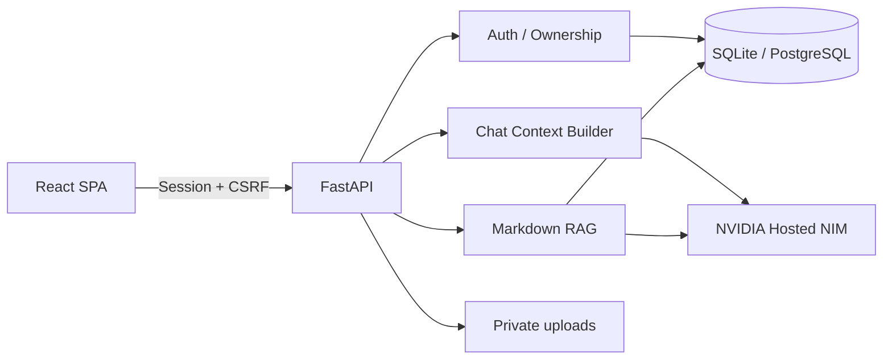

# NVIDIA NIM RAG Platform

**繁體中文** | [English](README.en.md)

[](https://github.com/richie7p/nvidia-nim-rag-platform/actions/workflows/ci.yml)

一套可自行部署、可換品牌、可直接替換 Markdown 知識庫的完整 RAG 平台。

這個 repository 是「系統架構版」：沒有綁定烏龜、學校或公司的特定內容。下載者只需要準備自己的 NVIDIA NIM API Key、放入自己的文件，就能建立組織專屬 AI 助理。

適合學校知識問答、公司內部文件、公協會服務、產品客服與任何需要私有知識庫的場景。想先看完整領域實作，可前往 [烏龜飼養小助手示範版](https://github.com/richie7p/turtle-care-assistant-demo)。

## 主要特色

- React + TypeScript 前端、FastAPI 後端、SQLAlchemy + SQLite
- NVIDIA Hosted NIM 文字串流、Vision 與 Embedding，不下載本機模型
- 使用者註冊／登入、HttpOnly Session、CSRF、Argon2 與資源權限隔離
- 多對話、SSE 串流、自動標題、摘要、Markdown 與引用卡片
- Markdown RAG：支援純 Markdown、選用 YAML frontmatter、子目錄與內容移除同步
- 完整管理後台：使用者、AI usage、知識向量、Provider 健康檢查與稽核
- `.env` 品牌設定：網站名稱、圖示、助理名稱、文案、知識名稱與免責聲明
- 自訂 System Prompt，不需修改 Python 或 React
- SQLite 開箱即用；可透過 `DATABASE_URL` 改接 PostgreSQL，但需另裝相容驅動並在部署環境完成 migration 與整合測試
- Production build 由 FastAPI 提供，只需啟動一個服務

## 可客製範圍

不修改程式即可替換 Markdown 知識、來源資料、品牌文案、System Prompt 與 NVIDIA NIM 模型設定，適合快速建立新的知識問答場景。

若新領域需要「學生 Profile」、「客戶案件」或簽核流程等結構化功能，仍須新增或調整資料表、API 與前端頁面。第一版內建的 `ModelProvider` 定義了替換邊界，但目前可直接使用的實作只有 NVIDIA Hosted NIM；vLLM 或其他 Provider 尚未內建。

## 架構



## 安裝需求

- Git
- Python 3.11（請確認 `python --version`）
- Node.js 22 以上（建議使用目前的 LTS 版）
- 可連線至 `https://integrate.api.nvidia.com`
- 自己的 NVIDIA NIM API Key；前往 [NVIDIA Build](https://build.nvidia.com/mistralai/ministral-14b-instruct-2512) 登入並選擇 **Generate API Key**

Hosted NIM 由 NVIDIA 雲端執行，因此安裝本專案不需要 NVIDIA GPU 或本機模型。NVIDIA 免費端點可能有額度與流量限制，實際條款以 NVIDIA 頁面為準。

## Windows 快速開始

在 PowerShell 執行：

```powershell
git clone https://github.com/richie7p/nvidia-nim-rag-platform.git
Set-Location nvidia-nim-rag-platform
python -m venv .venv
.\.venv\Scripts\python.exe -m pip install -r backend\requirements-dev.txt
Set-Location frontend
npm.cmd ci
Set-Location ..
Copy-Item .env.example .env
```

先產生 Session Secret：

```powershell
.\.venv\Scripts\python.exe -c "import secrets; print(secrets.token_urlsafe(48))"
```

把輸出結果與自己的 NVIDIA Key 填入 `.env`：

```env
SESSION_SECRET=請換成至少32字元的隨機字串
AI_API_KEY=你的_NVIDIA_NIM_API_Key
```

API Key 只存在伺服器端的 `.env`；不會傳到瀏覽器，`.env` 也已被 `.gitignore` 排除。

初始化資料庫、互動式建立管理員並啟動：

```powershell
Set-Location backend
..\.venv\Scripts\python.exe -m alembic upgrade head
..\.venv\Scripts\python.exe -m app.cli init-db
..\.venv\Scripts\python.exe -m app.cli create-admin
Set-Location ..
.\start.cmd
```

`start.cmd` 會自動建置前端、執行 migration 並啟動 FastAPI，不必直接執行可能被 Execution Policy 阻擋的 `.ps1`。開啟 <http://127.0.0.1:8000>；本專案沒有預設帳密。development 模式的 API 文件位於 <http://127.0.0.1:8000/api/docs>。

## macOS／Linux 快速開始

```bash
git clone https://github.com/richie7p/nvidia-nim-rag-platform.git
cd nvidia-nim-rag-platform
python3 -m venv .venv
.venv/bin/python -m pip install -r backend/requirements-dev.txt
cd frontend
npm ci
cd ..
cp .env.example .env
.venv/bin/python -c "import secrets; print(secrets.token_urlsafe(48))"
```

把最後一行輸出的 Secret 與自己的 NVIDIA Key 填入 `.env`，再執行：

```bash
cd backend
../.venv/bin/python -m alembic upgrade head
../.venv/bin/python -m app.cli init-db
../.venv/bin/python -m app.cli create-admin
cd ..
bash scripts/start.sh
```

開啟 <http://127.0.0.1:8000>。若要讓腳本可直接執行，可另外執行 `chmod +x scripts/start.sh`。

## 第一次使用與驗收

1. 瀏覽 <http://127.0.0.1:8000/api/health>，確認 `status` 是 `ok`、`configured` 是 `true`。
2. 使用剛才互動式建立的管理員帳號登入；一般使用者可從註冊頁建立自己的帳號，系統沒有預設密碼。
3. 把自己的 Markdown 放進 `knowledge/`，先執行 `validate-knowledge`，再執行 `sync-knowledge` 或在管理後台的知識庫頁同步。
4. 在管理後台執行 NVIDIA Provider 檢查，確認 Chat、Vision 與 Embedding 模型均可使用。
5. 建立新對話並詢問文件內明確存在的問題，確認回答完成串流且顯示正確引用；再詢問文件沒有提供的內容，確認系統不會捏造來源。

`/api/health` 只會回報是否已填入 Key，不會驗證 Key 是否有效；真實連線請以管理後台 Provider 檢查與實際對話為準。

## 換成自己的 RAG

1. 把 `.md` 文件放進 `knowledge/`，可使用子目錄。
2. 不寫 YAML 也可以；系統會使用第一個 `# 標題`、檔名與「本機知識庫」預設值。
3. 先做不呼叫 AI 的檢查：

```powershell
Set-Location backend
..\.venv\Scripts\python.exe -m app.cli validate-knowledge
```

4. 建立或更新向量：

```powershell
..\.venv\Scripts\python.exe -m app.cli sync-knowledge
```

也可以登入管理後台，在「知識庫」分頁按「同步知識庫」。修改文件會重建該文件片段；刪除文件或清空資料夾會將舊文件停用，不會繼續被檢索。

### 選用 frontmatter

```markdown
---
slug: leave-policy
title: 請假辦法
description: 員工請假流程與核准規則
source_name: 人力資源部
source_url: https://example.edu/policy/leave
reviewed_at: 2026-08-12
tags: [人事, 請假]
---

# 請假辦法

在這裡放完整知識內容。
```

`source_url` 可以省略，省略後引用卡仍會顯示文件名稱，但不會產生外部連結。

## 換品牌與 System Prompt

在 `.env` 修改 `APP_NAME`、`APP_ICON`、`ASSISTANT_NAME`、`KNOWLEDGE_LABEL`、首頁文案與免責聲明。自訂提示詞放在：

```text
prompts/assistant.md
```

也可以用 `SYSTEM_PROMPT=` 直接覆蓋檔案內容。修改 `.env` 或提示詞後請重新啟動服務。

## NVIDIA 模型

- Chat：[`mistralai/ministral-14b-instruct-2512`](https://build.nvidia.com/mistralai/ministral-14b-instruct-2512)
- Fallback：[`mistralai/mistral-nemotron`](https://build.nvidia.com/mistralai/mistral-nemotron)
- Vision：[`mistralai/ministral-14b-instruct-2512`](https://build.nvidia.com/mistralai/ministral-14b-instruct-2512)
- Embedding：[`nvidia/llama-nemotron-embed-1b-v2`](https://build.nvidia.com/nvidia/llama-nemotron-embed-1b-v2/modelcard)

預設 Ministral 同時支援文字與圖片；NVIDIA 的模型資料列出中文為支援語言，Embedding 模型也列出中文與跨語言檢索能力。Hosted 模型供應狀態可能改變，所有型號都可在 `.env` 更換。若沒有填 API Key，帳號與管理功能仍可開啟，AI 操作會顯示安全提示。正式使用前仍應用自己的 Key 與實際資料完成文字、圖片及 Embedding Smoke Test。

## 在伺服器部署

本機快速開始預設只監聽 `127.0.0.1`。公開部署至少需要：

```env
APP_ENV=production
APP_ORIGIN=https://assistant.example.org
SESSION_SECRET=獨立產生的長隨機字串
```

在反向代理後方以單一程序啟動：

```bash
APP_HOST=0.0.0.0 APP_PORT=8000 bash scripts/start.sh
```

Windows Server 可改用：`$env:APP_HOST='0.0.0.0'; $env:APP_PORT='8000'; .\start.cmd`。

- 使用 Caddy、Nginx 或雲端 Load Balancer 提供 HTTPS，並將 `/` 代理到 `127.0.0.1:8000`。
- `APP_ORIGIN` 必須是瀏覽器實際使用的 HTTPS Origin，不能保留範例網址。
- 持久化並備份 `backend/data/` 與 `backend/uploads/`；不要把它們提交到 Git。
- SQLite 適合單機與展示。多實例正式環境應改用 PostgreSQL、安裝相容驅動，並在 staging 驗證 migration；目前 CI 沒有測 PostgreSQL。
- 內建登入與 AI 限流是單一程序記憶體狀態。多 worker／多實例部署需要外部共享限流服務後再擴充。

## 測試

```powershell
Set-Location backend
..\.venv\Scripts\python.exe -m pytest -q
Set-Location ..\frontend
npm.cmd test
npm.cmd run build
npm.cmd run test:e2e
```

測試使用內部 Fake Provider，不需要公開或提交 NVIDIA Key。

相同測試會由 GitHub Actions 在 `windows-latest` 與 `ubuntu-latest` 執行。macOS/Linux 可把上述 Python 路徑換成 `../.venv/bin/python`，把 `npm.cmd` 換成 `npm`。

## 常見問題

- `start.ps1 無法載入`：請在專案根目錄執行 `.\start.cmd`，它只為這一次啟動套用 Execution Policy Bypass。
- `.venv was not found`：確認目前位於 clone 下來的 repository 根目錄，並重新執行建立 venv 與 pip 安裝步驟。
- 首頁顯示「frontend not built」：在 `frontend/` 執行 `npm ci`、`npm run build`，或重新執行啟動腳本。
- AI 顯示未設定：確認 `.env` 位於 repository 根目錄、變數名稱為 `AI_API_KEY`，修改後重新啟動服務。
- 模型停止服務或 404：到 NVIDIA Build 確認目前可用模型，再更新 `.env` 的模型 ID；更新 Embedding 模型後要重新執行 `sync-knowledge`。
- Port 8000 已被使用：先停止舊服務，或設定 `APP_PORT` 後啟動，例如 PowerShell 的 `$env:APP_PORT='8010'; .\start.cmd`。

## 安全提醒

- 不要提交 `.env`、資料庫、uploads 或任何 API Key。
- 曾貼到公開 issue、commit、截圖或聊天的 Key 應立即撤銷。
- 管理後台不提供私人訊息內容查閱。
- 公開部署前應設定 HTTPS、Production 環境、可信任 Origin 與外部秘密管理服務。

## License

MIT
