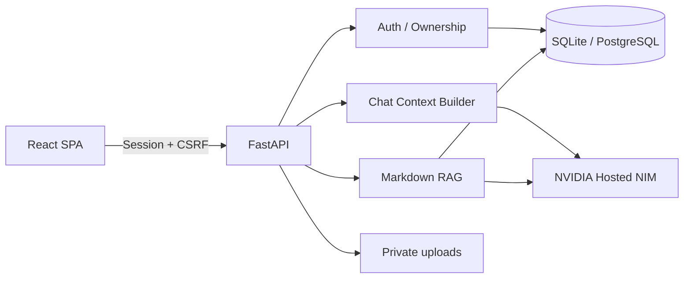

# NVIDIA NIM RAG Platform

**繁體中文** | [English](README.en.md)

[](https://github.com/richie7p/nvidia-nim-rag-platform/actions/workflows/ci.yml)

一套可自行部署、可換品牌、可直接替換 Markdown 知識庫的完整 RAG 平台。

這個 repository 是「系統架構版」：沒有綁定烏龜、學校或公司的特定內容。下載者只需要準備自己的 NVIDIA NIM API Key、放入自己的文件，就能建立組織專屬 AI 助理。

適合學校知識問答、公司內部文件、公協會服務、產品客服與任何需要私有知識庫的場景。想先看完整領域實作，可前往 [烏龜飼養小助手示範版](https://github.com/richie7p/turtle-care-assistant-demo)。

## 主要特色

- React + TypeScript 前端、FastAPI 後端、SQLAlchemy + SQLite
- NVIDIA Hosted NIM 文字串流、Vision 與 Embedding，不下載本機模型
- 使用者註冊／登入、HttpOnly Session、CSRF、Argon2 與資源權限隔離
- 多對話、SSE 串流、自動標題、摘要、Markdown 與引用卡片
- Markdown RAG：支援純 Markdown、選用 YAML frontmatter、子目錄與內容移除同步
- 完整管理後台：使用者、AI usage、知識向量、Provider 健康檢查與稽核
- `.env` 品牌設定：網站名稱、圖示、助理名稱、文案、知識名稱與免責聲明
- 自訂 System Prompt，不需修改 Python 或 React
- SQLite 開箱即用，透過 `DATABASE_URL` 可切換 PostgreSQL
- Production build 由 FastAPI 提供，只需啟動一個服務

## 可客製範圍

不修改程式即可替換 Markdown 知識、來源資料、品牌文案、System Prompt 與 NVIDIA NIM 模型設定，適合快速建立新的知識問答場景。

若新領域需要「學生 Profile」、「客戶案件」或簽核流程等結構化功能，仍須新增或調整資料表、API 與前端頁面。第一版內建的 `ModelProvider` 定義了替換邊界，但目前可直接使用的實作只有 NVIDIA Hosted NIM；vLLM 或其他 Provider 尚未內建。

## 架構



## 快速開始

需求：Python 3.11、Node.js 22 以上。

```powershell
python -m venv .venv
.\.venv\Scripts\python.exe -m pip install -r backend\requirements-dev.txt
Set-Location frontend
npm.cmd install
Set-Location ..
Copy-Item .env.example .env
```

開啟 `.env` 並填入自己的設定：

```env
SESSION_SECRET=請換成至少32字元的隨機字串
AI_API_KEY=你的_NVIDIA_NIM_API_Key
```

API Key 只存在伺服器端的 `.env`；不會傳到瀏覽器，`.env` 也已被 `.gitignore` 排除。

初始化並啟動：

```powershell
Set-Location backend
..\.venv\Scripts\python.exe -m alembic upgrade head
..\.venv\Scripts\python.exe -m app.cli init-db
..\.venv\Scripts\python.exe -m app.cli create-admin
Set-Location ..
.\start.cmd
```

開啟 <http://127.0.0.1:8000>。API 文件在 development 模式位於 <http://127.0.0.1:8000/api/docs>。

## 換成自己的 RAG

1. 把 `.md` 文件放進 `knowledge/`，可使用子目錄。
2. 不寫 YAML 也可以；系統會使用第一個 `# 標題`、檔名與「本機知識庫」預設值。
3. 先做不呼叫 AI 的檢查：

```powershell
Set-Location backend
..\.venv\Scripts\python.exe -m app.cli validate-knowledge
```

4. 建立或更新向量：

```powershell
..\.venv\Scripts\python.exe -m app.cli sync-knowledge
```

也可以登入管理後台，在「知識庫」分頁按「同步知識庫」。修改文件會重建該文件片段；刪除文件或清空資料夾會將舊文件停用，不會繼續被檢索。

### 選用 frontmatter

```markdown
---
slug: leave-policy
title: 請假辦法
description: 員工請假流程與核准規則
source_name: 人力資源部
source_url: https://example.edu/policy/leave
reviewed_at: 2026-08-12
tags: [人事, 請假]
---

# 請假辦法

在這裡放完整知識內容。
```

`source_url` 可以省略，省略後引用卡仍會顯示文件名稱，但不會產生外部連結。

## 換品牌與 System Prompt

在 `.env` 修改 `APP_NAME`、`APP_ICON`、`ASSISTANT_NAME`、`KNOWLEDGE_LABEL`、首頁文案與免責聲明。自訂提示詞放在：

```text
prompts/assistant.md
```

也可以用 `SYSTEM_PROMPT=` 直接覆蓋檔案內容。修改 `.env` 或提示詞後請重新啟動服務。

## NVIDIA 模型

- Chat：`nvidia/nemotron-3-nano-30b-a3b`
- Fallback：`mistralai/mistral-nemotron`
- Vision：`nvidia/nemotron-nano-12b-v2-vl`
- Embedding：`nvidia/llama-nemotron-embed-1b-v2`

模型供應狀態可能改變，所有型號都可在 `.env` 更換。若使用者沒有填 API Key，帳號與管理功能仍可開啟，AI 操作會顯示安全提示。

NVIDIA 目前的 [Vision Model Card](https://build.nvidia.com/nvidia/nemotron-nano-12b-v2-vl/modelcard) 將 `nvidia/nemotron-nano-12b-v2-vl` 的語言支援標示為 English only。若產品需要穩定的繁體中文圖片回答，請用私人 Key 完成真實中文 Smoke Test，並視結果更換為明確支援目標語言的 Vision 模型。

## 測試

```powershell
Set-Location backend
..\.venv\Scripts\python.exe -m pytest -q
Set-Location ..\frontend
npm.cmd test
npm.cmd run build
npm.cmd run test:e2e
```

測試使用內部 Fake Provider，不需要公開或提交 NVIDIA Key。

## 安全提醒

- 不要提交 `.env`、資料庫、uploads 或任何 API Key。
- 曾貼到公開 issue、commit、截圖或聊天的 Key 應立即撤銷。
- 管理後台不提供私人訊息內容查閱。
- 公開部署前應設定 HTTPS、Production 環境、可信任 Origin 與外部秘密管理服務。

## License

MIT
